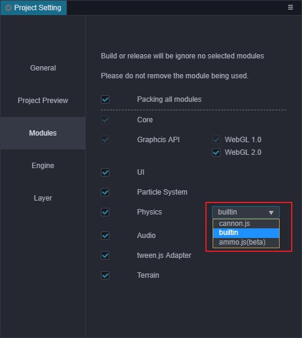

# 物理测试说明

目前物理测试项目有两个，分别为 builtin 和 cannon 。

对应的测试场景在对应的文件夹 builtin 和 cannon 中。

两个的测试需要在不同的模块选项中进行，设置模块选项要去 “工程” -> “模块设置” 中，将 physics 选项设置成相应的物理测试项中，如 模块.jpg 所示。

注意：构建不同测试项目时，也要将模块选项设置成相应的选项，否则效果会不正确；
